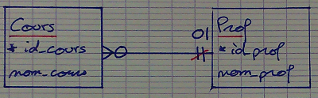
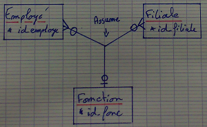
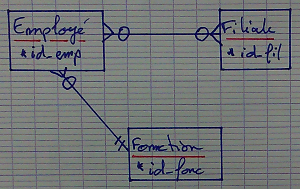
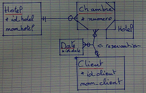

[TOC]


##Traduction relation  1-n

On reporte la clef du coté ```1``` dans l'autre table comme clef etrangère

```
Film(*id_film, titre_film, annee_sortie, id_realisateur #(reference à artiste), id_film_origine# (reference a film))
```

Quand le film n'est pas un remake, ou si le film dont c'est le remake n'est pas dans la base : on met la valeur ```NULL```.

```
Artiste(* id_artiste, nom_artiste, prenom_artiste, date_)
JoueDans(*id_artiste#, *id_film#)
Film
```


##Relation 1-1

| Pays |
|-------|
| ***nom_pays** |  


| Ville |
|-------|
| ***id_ville** |  
| nom_ville |  


```
 ____________               ____________
|  Pays     |-1-0-----1-1-| VIlle      |
|---------- |             |------------|
| *nom_pays |-1-1------0<-| *id_ville* |
|___________|             |nom_ville   |
                          |____________|

Pays ------- Ville (est capital)
Ville --------- Pays (est dans)
```

On choisit de reporter la clef primaire d'une des tables (de préference celle du coté 1-1) comme clef etrangère de l'autre

```
Pays(* nom, id_capital#(capital))
Ville(*id_ville, nom_ville, nom_pays#(est dans))
```

Quand on as ```-0-1-``` des deux coté on choisit ce qui est le plus logique.
On est quelquefois obligé de mettre une cardinalité minimum à 0
* Pour des raisons d'ordre de remplissage
* On peut momentanement ne pas avoir de relation





(Création du cours avant l'affectation de l'eseignent, demission)

l'attribution de la relation est reportée dans la même table que pour la clef primaire

```
Cours(*id_cours, nom_cours, id_prof#, nb_heure)
Prof(*id_prof, nom_prof)
```


##Relation n-n-n
###Traduction

On traduit en faisant une table regroupant les clef primaire des trois entités
dans le cas ```n-n-n```  la clef primaire de la relation est l'ensemble des trois clefs





``` Assume(*id_emp#, *id_fil#, *id_fonc#)```
| *id_emp# | *id_fil# | *id_fonc# |
|-------|-----|----|
| 1 | A | 101 |
| 1 | A | 102 |
| 1 | B | 101 |
| 2 | A | 101 |


On suppose maintenant que dans une filial donnée. L'employé n'assume qu'une seul fonction
(Mais pas forcement la même fonction suivant la filial)




``` Assume(*id_emp#, *id_fil#, id_fonc#)```


| *id_emp# | *id_fil# | id_fonc# |
|-------|-----|----|
| 1 | A | 101 |
| 1 | B | 102 |
| 1 | C | 103 |


### Attention

Si je suppose que l'employé assume toujours la même fonction dans differentes filiale
(on a deux relations binaire)


Il existe une relation ternaire ```1-1-n```  et ```1-1-1```


## Entité faible


```
Hotel(*id_hotel, ....)
Chambre(*(num, id_hotel#))
```

numero ne suffit pas comme clef primaire de chambre (chambre 404), on lui adjoint celle de hôtel




Le client peut réserver plusieurs chambre à la même date

```réservation((numero#, id_hotel#, d#), id_client#)```

```(numero, id_hotel)``` est clef étrangere se referent à chambre <br>
**i.e** tout couple ```(numero, id_hotel)``` de reservation sont dans chambre

Date ne donnera pas de table sinon ça donnerait une liste de __date__

Plus généralement, une fois la traduction éffectuée on ne garde une table a une seul colonne, on ne la garde que si ça correspond à un ensemble valeurs possible

***ex:*** liste des département français
